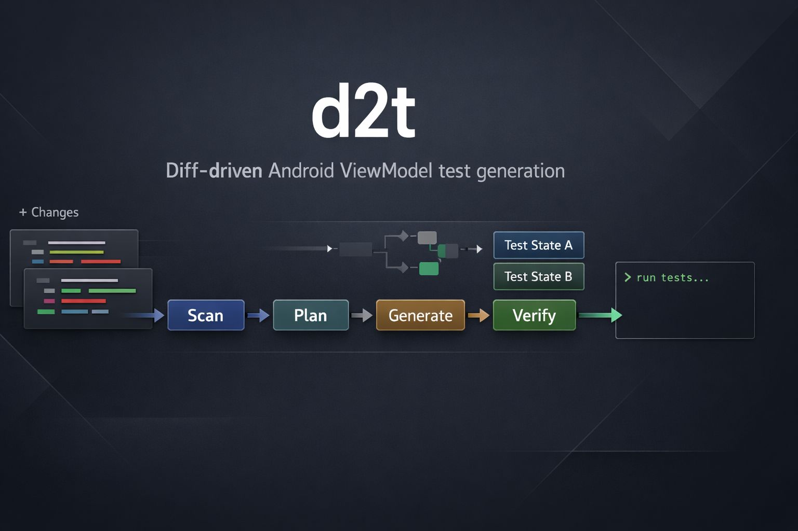

<div align="center">
  <h1>diff2test-android</h1>
  <p><strong>코드 diff 기반 Android ViewModel 테스트 생성 CLI</strong></p>
  <p>변경된 ViewModel을 감지하고, 테스트 계획을 만들고, local unit test 후보를 생성한 뒤, Gradle로 검증합니다.</p>
  <p>
    <a href="https://github.com/gay00ung/diff2test-android/stargazers">
      
    </a>
    <a href="https://github.com/gay00ung/diff2test-android/releases">
      
    </a>
    <a href="https://github.com/gay00ung/diff2test-android/releases">
      
    </a>
    
    
    
    
  </p>
  <p>
    <a href="./README.md">English</a>
    ·
    <a href="./README.ko.md">한국어</a>
  </p>
</div>

<p align="center">
  
</p>

> `d2t` 1.0은 한 가지에 집중합니다. 변경된 Android ViewModel을 검증 가능한 local unit test로 바꾸는 일입니다. 제품의 중심은 CLI이며, MCP 앱은 여전히 experimental 단계입니다.

## 왜 d2t인가요

Android 테스트 생성 도구는 대체로 두 가지 문제를 가집니다.

- 실제 diff를 보지 않고 너무 많은 테스트를 만듭니다.
- 테스트 코드는 생성하지만, 검증 단계에서 멈춥니다.

`d2t`는 이 흐름을 더 좁고 실용적으로 가져갑니다.

1. `git diff`에서 변경된 `*ViewModel.kt`를 찾습니다.
2. 변경된 ViewModel 표면과 collaborator를 분석합니다.
3. 시나리오 중심 `TestPlan`을 만듭니다.
4. local unit test 후보 코드를 생성합니다.
5. 생성된 테스트를 Gradle로 바로 검증합니다.

즉, 단순 코드 생성기가 아니라 개발 워크플로우 도구로 설계되어 있습니다.

## 1.0에서 포함하는 범위

`d2t` 1.0은 의도적으로 범위를 좁게 잡았습니다.

- diff 기반 Android ViewModel local unit test 생성
- 생성된 테스트의 Gradle 검증
- 사용자 소유 API 키 사용
- OpenAI Responses API 지원
- Anthropic Messages API 지원
- Gemini GenerateContent API 지원
- custom `responses-compatible` endpoint 지원
- custom `chat-completions` endpoint 지원
- 릴리스 ZIP 및 Homebrew 배포

## 1.0에서 약속하지 않는 범위

- transport가 연결된 정식 MCP 서버
- instrumented `androidTest` 생성
- Compose UI test 생성
- 완전한 end-to-end 자동 repair 루프
- 모든 Android 빌드 그래프에서 완벽한 외부 classpath symbol resolution

## 설치 방법

### Homebrew

```bash
brew install gay00ung/diff2test-android/d2t
```

원하면 tap을 먼저 등록한 뒤 짧은 이름으로 설치하실 수도 있습니다.

```bash
brew tap gay00ung/diff2test-android
brew install d2t
```

### 릴리스 ZIP

최신 릴리스의 `d2t.zip`을 내려받아 아래처럼 실행해주세요.

```bash
unzip d2t.zip
cd d2t
./bin/d2t help
```

### 소스에서 실행

```bash
git clone https://github.com/gay00ung/diff2test-android.git
cd diff2test-android
./gradlew test
./d2t help
```

## 빠른 시작

### 1. 설정 파일 만들기

```bash
d2t init
```

### 2. AI provider 연결하기

```toml
[ai]
enabled = true
provider = "custom"
protocol = "chat-completions"
api_key_env = "LLM_API_KEY"
model = "qwen3-coder-next-mlx"
base_url = "http://127.0.0.1:12345/v1"
connect_timeout_seconds = 30
request_timeout_seconds = 300
```

### 3. 설정 확인하기

```bash
d2t doctor
```

### 4. 현재 변경분 기준으로 생성 + 검증 실행하기

```bash
d2t auto --ai
```

소스에서 직접 실행하는 경우에는 `d2t` 대신 `./d2t`를 사용해주세요.

## 지원하는 AI 프로토콜

`~/.config/d2t/config.toml`에는 실제 비밀키를 넣지 않고, 비밀키가 들어 있는 환경변수 이름만 저장합니다.

현재 지원하는 provider/protocol 조합은 아래와 같습니다.

- `provider = "openai"` + `protocol = "responses-compatible"`
- `provider = "anthropic"` + `protocol = "anthropic-messages"`
- `provider = "gemini"` + `protocol = "gemini-generate-content"`
- `provider = "custom"` + `protocol = "responses-compatible"`
- `provider = "custom"` + `protocol = "chat-completions"`

예:

```bash
source ~/.zshrc
d2t doctor
d2t auto --ai
```

## 동작 방식

전체 흐름은 아래와 같습니다.

```text
git diff
  -> 변경된 ViewModel 감지
  -> ViewModel 분석
  -> TestPlan 생성
  -> AI 또는 deterministic 코드 생성
  -> quality gate
  -> Gradle 검증
```

핵심 포인트는 이렇습니다.

- 모델에게 레포 전체를 던지고 막 생성하게 하지 않습니다.
- 먼저 diff와 ViewModel 분석 결과로 생성 범위를 좁힙니다.
- 생성된 테스트는 quality gate를 통과해야 합니다.
- `auto`는 기본적으로 생성과 검증을 함께 수행합니다.
- `--repair`를 주면 import 및 coroutine-test utility 관련 공통 오류에 대해 bounded repair를 1회 시도합니다.

## 명령어

```bash
d2t init [--force]
d2t doctor
d2t scan
d2t plan path/to/SomeViewModel.kt
d2t generate path/to/SomeViewModel.kt --write [--ai|--no-ai] [--strict-ai]
d2t auto [--ai|--no-ai] [--strict-ai] [--model model-name] [--no-verify] [--repair]
d2t verify :module:testTask
```

## 문제 해결

### `No changed ViewModel files were detected`

- 현재 working tree에 수정된 `*ViewModel.kt`가 있는지 먼저 확인해주세요.
- 아니면 `plan`이나 `generate`에 파일 경로를 직접 넘겨주세요.

### AI 요청이 timeout 됩니다

- `request_timeout_seconds`를 늘려주세요.
- 더 빠른 모델로 바꿔주세요.
- 게이트웨이가 그 경로를 더 안정적으로 처리한다면 `protocol = "chat-completions"`를 우선 사용해주세요.

### 생성된 테스트가 quality gate에서 막힙니다

- 생성된 결과가 너무 취약하거나 불완전하다는 뜻입니다.
- 보통은 Gradle 문제가 아니라 생성 품질 문제입니다.
- 더 강한 모델로 다시 시도하거나, 검증까지 포함할 때 `--repair`를 같이 사용해주세요.

### 생성은 됐는데 verify에서 실패합니다

- `src/test/kotlin/...GeneratedTest.kt` 파일을 먼저 확인해주세요.
- CLI가 출력한 Gradle 검증 명령을 직접 실행해보세요.
- import나 coroutine utility 관련 문제라면 `d2t auto --ai --repair`로 다시 시도해주세요.

## 레포 구조

- `apps/cli`: 메인 CLI 앱
- `apps/mcp-server`: experimental MCP 카탈로그 스캐폴딩
- `modules/*`: 엔진 모듈
- `prompts/*`: 프롬프트 템플릿과 정책
- `fixtures/*`: 샘플 앱과 검증용 fixture
- `docs/*`: 아키텍처와 배포 문서

## 배포 경로

이 레포에는 아래가 포함되어 있습니다.

- Homebrew formula: [`packaging/homebrew/d2t.rb`](./packaging/homebrew/d2t.rb)
- 릴리스 자동화: [`.github/workflows/release.yml`](./.github/workflows/release.yml)
- 태그 자동화: [`.github/workflows/tag-release.yml`](./.github/workflows/tag-release.yml)
- 배포 ZIP 생성: `./gradlew :apps:cli:distZip`

생성된 ZIP은 아래 경로에 저장됩니다.

```bash
apps/cli/build/distributions/d2t.zip
```

## 제품 범위

안정화된 제품 표면은 CLI입니다.

MCP 앱은 아직 experimental입니다.

- 카탈로그 스캐폴딩 용도로는 의미가 있습니다.
- 하지만 production용 transport-bound MCP 서버로 포지셔닝하지는 않습니다.

자세한 릴리스 기준과 로드맵은 아래 문서를 참고해주세요.

- [`docs/release-gate-1.0.md`](./docs/release-gate-1.0.md)
- [`docs/roadmap-1.0.md`](./docs/roadmap-1.0.md)
